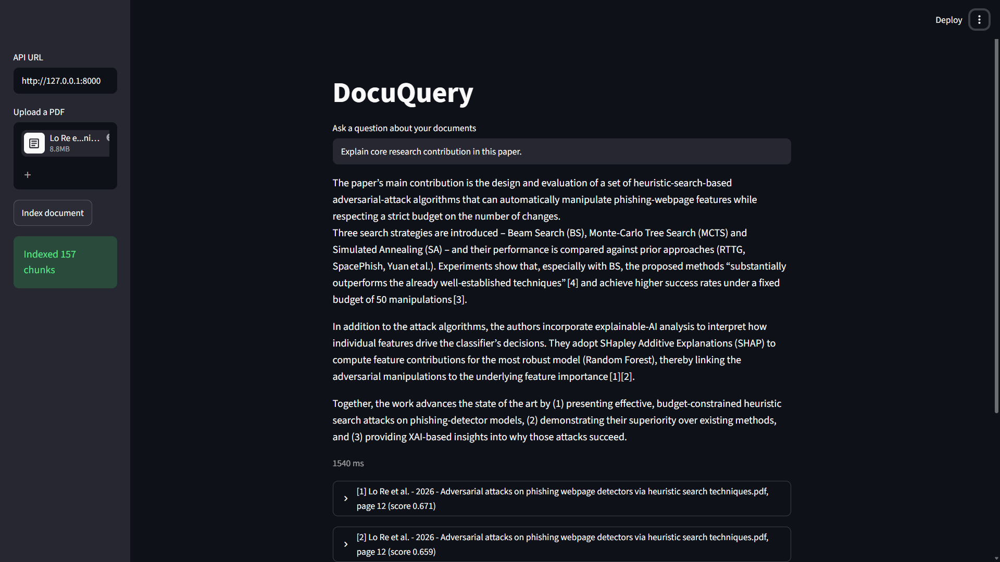
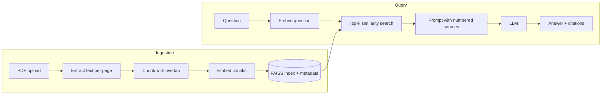

# DocuQuery: chat with your PDFs

Upload PDFs, ask questions in plain English, and get answers that **cite the file and page** they came from.
A small retrieval-augmented generation (RAG) service built with FastAPI, FAISS and an LLM API.



## Features
- Page-aware PDF ingestion and overlapping text chunking
- Semantic search with local embeddings (`BAAI/bge-small-en-v1.5` via fastembed, no embedding API costs)
- FAISS vector index (cosine similarity), persisted to disk
- Grounded answers from any OpenAI-compatible LLM, with inline citations like `[1]`, `[2]`
- Refuses to answer when the documents don't contain the answer
- REST API with auto-generated Swagger docs, plus an optional Streamlit UI
- Unit and end-to-end tests, GitHub Actions CI, Dockerfile, Cloud Run deployment

## How it works


## Quickstart
```bash
git clone https://github.com/<your-username>/docuquery.git && cd docuquery
python -m venv .venv && source .venv/bin/activate   # Windows: .venv\Scripts\activate
pip install -r requirements.txt
cp .env.example .env        # add your LLM API key
uvicorn app.main:app --reload
```
Open <http://127.0.0.1:8000/docs>, upload a PDF with `POST /documents`, then ask with `POST /ask`.
The first start downloads the embedding model (one-time).

Optional UI: `pip install streamlit && streamlit run ui/streamlit_app.py`

### Docker
```bash
docker build -t docuquery .
docker run -p 8000:8080 --env-file .env docuquery
```

## API
| Method | Path | Description |
|---|---|---|
| GET | `/health` | Liveness check and number of indexed chunks |
| POST | `/documents` | Upload a PDF (multipart field `file`) |
| GET | `/documents` | List indexed documents |
| POST | `/ask` | `{"question": "...", "top_k": 4}` returns the answer, numbered sources and latency |

```bash
curl -F "file=@paper.pdf" http://127.0.0.1:8000/documents
curl -X POST http://127.0.0.1:8000/ask -H "Content-Type: application/json" \
     -d '{"question": "What are the main findings?"}'
```

## Configuration
| Variable | Default | Purpose |
|---|---|---|
| `LLM_API_KEY` | none | API key for your LLM provider |
| `LLM_MODEL` | `gpt-4o-mini` | Chat model name |
| `LLM_BASE_URL` | OpenAI | Any OpenAI-compatible endpoint (Groq, Gemini, Ollama, ...) |
| `EMBED_MODEL` / `EMBED_DIM` | `BAAI/bge-small-en-v1.5` / `384` | Embedding model and its vector size |
| `CHUNK_SIZE` / `CHUNK_OVERLAP` | `800` / `150` | Chunking, in characters |
| `TOP_K` | `4` | Passages sent to the LLM |

## Design decisions
- **Page-bounded chunks**, so every citation points to an exact page.
- **Local embeddings** keep retrieval free, fast and private; only the final answer step calls an LLM.
- **`IndexFlatIP` on normalised vectors** gives exact cosine search, simple and fast at this scale.
- **Provider-agnostic LLM layer**: one OpenAI-compatible client configured through environment variables.
- **Strict grounding prompt** with a required refusal sentence to limit hallucination.

## Evaluation
Retrieval hit@4 on 15 hand-labelled questions: **73% in 800 chunk size and 80% in 500 chunk size** 
(`python -m evaluation.run_eval`).
Median server-side `/ask` time: **10.6 s** over 20 requests.


## Limitations
- No OCR: scanned PDFs are rejected. The embedding model is English-only.
- Tables and figures are not parsed. No authentication.
- The index lives on local disk, so it resets when a Cloud Run instance restarts.

## Roadmap
Hybrid BM25 + vector search, reranking, streaming answers, OCR, authentication and per-user indexes, a persistent vector database (pgvector), multilingual embeddings.